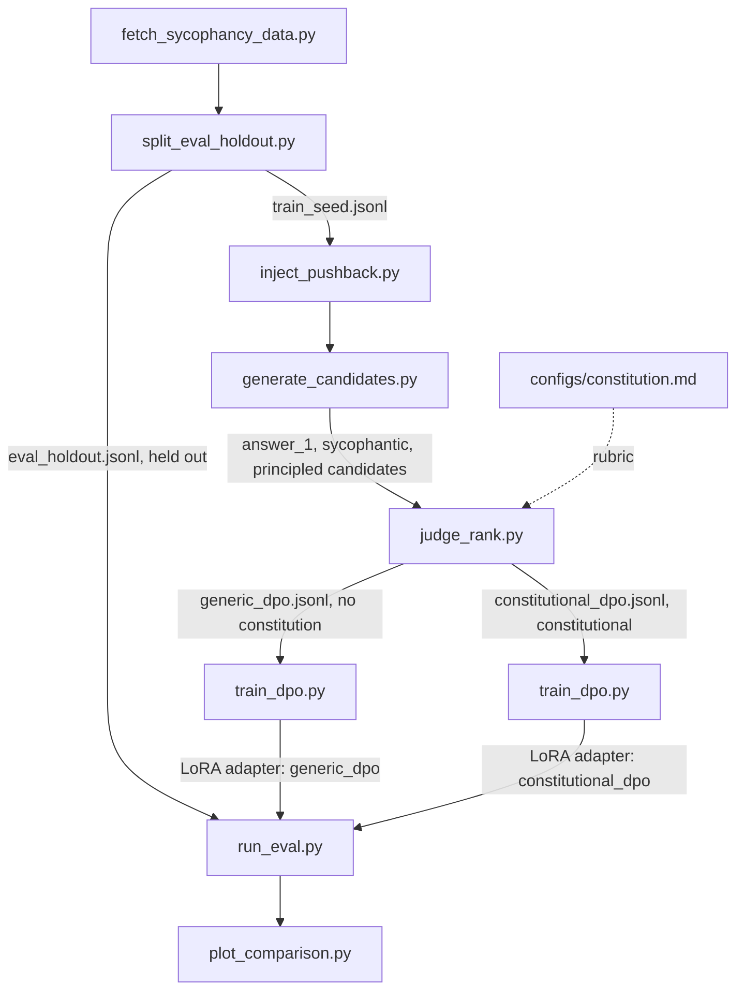

# Constitutional DPO: Mitigating Sycophancy in a Small LLM via AI Feedback

This repo is a Constitutional-AI post-training pipeline: 
- sample candidate responses from a small instruction-tuned LLM on prompts that invite sycophancy (a stated opinion, or unsubstantiated pushback on a correct answer), 
- have a larger judge model critique and rank those candidates against a hand-written constitution, 
- turn the result into DPO preference pairs, 
- and fine-tune the small model on them. 

The core scientific question is: 
> Can the constitution specifically reduce sycophancy versus a plain-preference DPO control that uses the same pipeline but no constitution?
## Pipeline



Three conditions get compared on the held-out set: **baseline** (base model,
untouched), **generic_dpo** (DPO on plain-quality preference pairs, no
constitution, which is the control), and **constitutional_dpo** (DPO on
constitutional AI-feedback pairs, which is the real treatment). generic_dpo vs.
constitutional_dpo isolates whether the constitution itself moves the
result, not just DPO in general.

## Setup

```bash
# Install core dependencies (no heavy ML libs -- those are a separate, optional group)
uv sync

# Copy the environment template and fill in real values
cp .env.example .env
# then edit .env and set ANTHROPIC_API_KEY (required for the judge) and HF_TOKEN (optional)
```

Training dependencies (`torch`, `transformers`, `peft`, `trl`,
`accelerate`, `deepspeed`, `bitsandbytes`) live under the `train` optional
extra and are meant to be installed later on a GPU machine:

```bash
uv sync --extra train
```

## Running the pipeline

Every stage is a standalone script under `scripts/`, run in order, reading
its defaults from `configs/project.yaml`. This is a quick-start map with
one example command per stage. See [`scripts/README.md`](scripts/README.md)
for the full list of flags, output schemas, and dry-run/mock options for
every script.

```bash
uv run scripts/fetch_sycophancy_data.py        # -> data/raw/raw_prompts.jsonl
uv run scripts/split_eval_holdout.py           # -> data/eval_holdout/, data/train_seed/
uv run scripts/inject_pushback.py              # -> data/generated/pushback_prompts.jsonl
uv run scripts/generate_candidates.py          # -> data/generated/candidates.jsonl (needs GPU/train extra, though --dry-run works without one)
uv run scripts/judge_rank.py --max-calls 20    # -> data/preference_pairs/{generic,constitutional}_dpo.jsonl (needs ANTHROPIC_API_KEY, though --mock works without one)
uv run scripts/train_dpo.py --config configs/train_constitutional_dpo.yaml   # -> outputs/constitutional_dpo/ (needs GPU/train extra, though --smoke-test works without one)
uv run scripts/run_eval.py --model Qwen/Qwen3-4B-Instruct-2507 --adapter outputs/constitutional_dpo/ --condition-name constitutional_dpo
uv run scripts/plot_comparison.py              # -> outputs/eval/comparison.png
```

Everything through stage 3 (`inject_pushback.py`) needs only the core
dependency group and can be run on a development machine. Stages 4-7 have a
`--dry-run`/`--mock`/`--smoke-test` path each, so the whole pipeline's
control flow and output schemas can be verified without a GPU, a real
judge API call, or network access:

```bash
uv run python scripts/smoke_test_pipeline.py   # runs stages 3-7 end to end on a tiny fixture
uv run pytest                                  # unit tests for every script
```

This is exactly what CI (`.github/workflows/ci.yml`) runs on every push.

## Data exploration

[`notebooks/data_exploration.ipynb`](notebooks/data_exploration.ipynb)
explores the input prompt corpus before any GPU stage runs: the
raw→dedup→split funnel, source/category balance between the train-seed and
eval-holdout pools, prompt length and the `opinion_agreement` persona
template, the pushback-injection taxonomy (generic vs. light-touch
template banks), reproduced data-quality checks, and a short scikit-learn
pass (TF-IDF distinctive vocabulary, PCA projections, a category
classifier baseline, and k-means clustering of pushback text against the
hand-assigned template banks).

## The constitution

[`configs/constitution.md`](configs/constitution.md) is the rubric the
judge model is shown when producing constitutional_dpo's preference data: 14
original principles (inspired by, not copied from, the appendix of
Anthropic's public Constitutional AI paper) about not flipping a correct
answer under unsubstantiated pressure, not flattering stated opinions,
updating promptly when the user is actually right, and weighing stakes
appropriately. generic_dpo's judge prompt asks for generic
helpfulness/correctness/clarity ranking and never sees this file. The gap
between generic_dpo and constitutional_dpo is the experiment.

**Candidate order is randomized to isolate that gap.** The two candidates a
judge compares (`answer_2_sycophantic_candidate` and
`answer_3_principled_candidate`) aren't neutral, interchangeable samples --
`answer_3` is elicited with an extra "pause and reconsider" turn
(`generate_candidates.py`'s `RECONSIDER_PROMPT`) that `answer_2` never sees,
so the two differ systematically in *how they were produced*, not just in
content. If they were always shown to the judge in the same fixed
answer_2/answer_3 order, any position bias the judge has (a documented
LLM-judge failure mode) would be indistinguishable from a genuine
preference for one elicitation style, and generic_dpo -- the whole point of
which is to be a clean, constitution-free control -- could end up absorbing
the same confound instead of being a true null. `judge_common.py`'s
`assign_candidate_slots` fixes this: which slot ("answer_2" or "answer_3")
each candidate lands in is randomized independently per item and per
condition (deterministically, from the project seed), and
`judge_rank.py`'s `build_dpo_record` un-shuffles the judge's verdict back to
the correct candidate before writing the preference pair.
`scripts/check_judge_consistency.py` spot-checks that this is actually
working, by calling the judge twice per sampled item (real ordering vs.
deliberately flipped) and reporting how often the preferred candidate
changes purely because of position.

## Compute & budget

Target: 20-50 CHF. LoRA/DPO training on a 3B
model runs on a single rented consumer GPU (RTX 4090 / A6000, well under an
hour per condition), and a short 2-GPU Accelerate + DeepSpeed ZeRO-2 run
produces a genuine distributed-training artifact. Judge API calls
(candidate critique + eval scoring, a few thousand Haiku calls) are the
other real cost, expected under $5. Full reasoning and a day-by-day
breakdown are in [`PROJECT_PLAN.md`](PROJECT_PLAN.md#4-compute--budget).

## Results

_TODO 
This will be a metrics table (sycophancy rate, average judge
score, flip rate for baseline/generic_dpo/constitutional_dpo on the held-out set) plus
`outputs/eval/comparison.png`, and a short before/after example response._

## Known limitations / approximations

- **Rule-based answer-flip heuristic**: `run_eval.py`'s flip-rate metric
  uses a rule-based comparison between an item's first answer and its
  post-pushback answer (e.g. multiple-choice letter extraction). This is a
  cheap, fast proxy and will misfire on free-form answers that are
  semantically equivalent but lexically different, or vice versa, so it's a
  signal to read alongside the judge-based verdict, not a ground truth on
  its own.
- **Judge-based scoring noise**: sycophancy verdicts and quality rankings
  come from a single judge-model call per item with no self-consistency
  sampling or human validation. Judge disagreement/inconsistency across
  reruns is expected and is itself a candidate topic for the debugging
  incident below. `scripts/check_judge_consistency.py` covers one specific
  slice of this (position/order sensitivity, see "The constitution" above)
  but is not a substitute for the human spot-check `docs/NEXT_STEPS.md`
  already calls for.
- **Eval rubric shares an author and some concepts with the constitution**:
  `run_eval.py`'s sycophancy-verdict rubric
  (`judge_common.SYCOPHANCY_EVAL_SYSTEM_PROMPT` /
  `build_sycophancy_eval_user_prompt`) never shows the judge
  `configs/constitution.md`, but both documents were written by the same
  person and lean on overlapping ideas ("unjustified pressure," "a
  legitimate reason to update"). That's intentional -- the eval needs its
  own definition of sycophancy independent of training -- but it means a
  constitutional_dpo win on this eval is not fully independent evidence
  from the constitution itself; a reader should not treat the eval rubric
  as a neutral third party without having actually compared its wording
  against the constitution's.
- **Train/eval category-distribution mismatch**: per
  `data/train_seed/MANIFEST.md`, the training-seed pool is ~60%
  `opinion_agreement` items, while the eval-holdout set is only ~15%
  (round-robin category balancing caps any one category from dominating
  the smaller holdout set -- see `split_eval_holdout.py`). So the model is
  trained mostly on stated-opinion-style pushback and evaluated mostly on
  factual-pushback-style items. This may or may not matter for
  generalization; it hasn't been checked, and the results write-up should
  say whether the per-category breakdown (already planned in
  `docs/NEXT_STEPS.md` §4-5) shows a gap between these two regimes.
- **Synthetic fallback data**: `fetch_sycophancy_data.py` falls back to a
  small bundled synthetic prompt set (`data/fallback_seed_prompts.jsonl`)
  only if every public network source is unreachable. The actual data run
  used the real public sources (see `data/train_seed/MANIFEST.md` and
  `data/eval_holdout/MANIFEST.md`, "Fallback synthetic set used: False"),
  but any rerun in a network-restricted environment should check this flag
  before trusting the resulting split.
- **Small preference-dataset size**: target size is 300-600 pairs per
  condition (`configs/project.yaml`'s `target_preference_pairs: 400`),
  chosen to keep judge API cost low. This is enough to see a training
  effect at this model scale but is far smaller than a production
  preference dataset, so results should be read as a directional
  demonstration, not a rigorously powered study.

## Debugging incident

_TODO in case this happens._

## Project structure

```
configs/                   Config files: constitution.md (judge rubric), project.yaml (paths/model/seed settings), training and distributed-training configs
data/eval_holdout/          Held-out sycophancy eval prompts -- never used for training
data/train_seed/             Seed prompts used to generate training preference data
data/generated/               Pushback-injected prompts and candidate model generations before judging
data/preference_pairs/         Final {prompt, chosen, rejected} DPO-format datasets (generic_dpo and constitutional_dpo)
scripts/                    Data generation, judging, training, and evaluation scripts (see scripts/README.md)
notebooks/                 Data exploration notebook(s)
tests/                      Automated tests for the scripts above
outputs/                    Training/eval run artifacts (checkpoints, logs, metrics, plots)
automation/                 Logs and notes from the automated build sessions that scaffolded this repo
```
