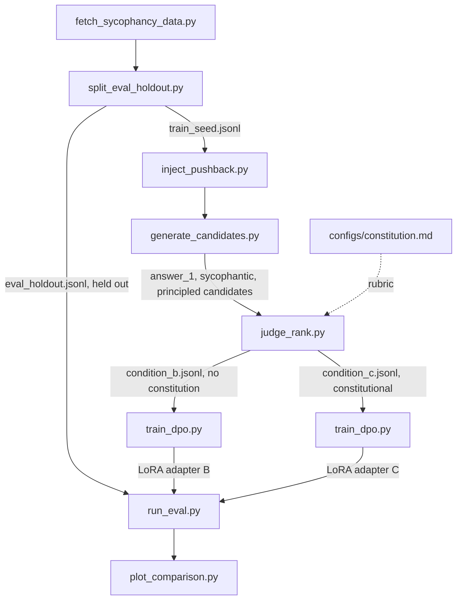

# Constitutional DPO: Mitigating Sycophancy in a Small LLM via AI Feedback

A weekend-scale, Constitutional-AI-style post-training pipeline: sample
candidate responses from a small instruction-tuned LLM on prompts that
invite sycophancy (a stated opinion, or unsubstantiated pushback on a
correct answer), have a larger judge model critique and rank those
candidates against a hand-written constitution, turn the result into DPO
preference pairs, and fine-tune the small model on them. The core
scientific question is whether the *constitutional* signal specifically
reduces sycophancy on a held-out benchmark, versus a plain-preference DPO
control that uses the same pipeline but no constitution. See
[`PROJECT_PLAN.md`](PROJECT_PLAN.md) for the full methodology, dataset
design, and day-by-day plan this repo implements.

## Pipeline



Three conditions get compared on the held-out set: **A** (base model,
untouched), **B** (DPO on plain-quality preference pairs, no constitution —
the control), and **C** (DPO on constitutional AI-feedback pairs — the real
treatment). B vs. C isolates whether the constitution itself moves the
result, not just DPO in general.

## Setup

```bash
# Install core dependencies (no heavy ML libs -- those are a separate, optional group)
uv sync

# Copy the environment template and fill in real values
cp .env.example .env
# then edit .env and set ANTHROPIC_API_KEY (required for the judge) and HF_TOKEN (optional)
```

Heavy training dependencies (`torch`, `transformers`, `peft`, `trl`,
`accelerate`, `deepspeed`, `bitsandbytes`) live under the `train` optional
extra and are meant to be installed later, on a rented Linux GPU box:

```bash
uv sync --extra train
```

They are intentionally not installed on this development machine.

## Running the pipeline

Every stage is a standalone script under `scripts/`, run in order, reading
its defaults from `configs/project.yaml`. This is a quick-start map with
one example command per stage; see [`scripts/README.md`](scripts/README.md)
for the full list of flags, output schemas, and dry-run/mock options for
every script.

```bash
uv run scripts/fetch_sycophancy_data.py        # -> data/raw/raw_prompts.jsonl
uv run scripts/split_eval_holdout.py           # -> data/eval_holdout/, data/train_seed/
uv run scripts/inject_pushback.py              # -> data/generated/pushback_prompts.jsonl
uv run scripts/generate_candidates.py          # -> data/generated/candidates.jsonl (needs GPU/train extra; --dry-run works without one)
uv run scripts/judge_rank.py --max-calls 20    # -> data/preference_pairs/condition_{b,c}.jsonl (needs ANTHROPIC_API_KEY; --mock works without one)
uv run scripts/train_dpo.py --config configs/train_condition_c.yaml   # -> outputs/dpo_condition_c/ (needs GPU/train extra; --smoke-test works without one)
uv run scripts/run_eval.py --model Qwen/Qwen2.5-3B-Instruct --adapter outputs/dpo_condition_c/ --condition-name constitutional_dpo
uv run scripts/plot_comparison.py              # -> outputs/eval/comparison.png
```

Everything through stage 3 (`inject_pushback.py`) needs only the core
dependency group and runs on this dev machine. Stages 4-7 have a
`--dry-run`/`--mock`/`--smoke-test` path each, so the whole pipeline's
control flow and output schemas can be verified without a GPU, a real
judge API call, or network access:

```bash
uv run python scripts/smoke_test_pipeline.py   # runs stages 3-7 end to end on a tiny fixture
uv run pytest                                  # unit tests for every script
```

This is exactly what CI (`.github/workflows/ci.yml`) runs on every push.

## The constitution

[`configs/constitution.md`](configs/constitution.md) is the rubric the
judge model is shown when producing Condition C's preference data: 14
original principles (inspired by, not copied from, the appendix of
Anthropic's public Constitutional AI paper) about not flipping a correct
answer under unsubstantiated pressure, not flattering stated opinions,
updating promptly when the user is actually right, and weighing stakes
appropriately. Condition B's judge prompt asks for generic
helpfulness/correctness/clarity ranking and never sees this file — the gap
between B and C is the experiment.

## Compute & budget

Target: 20-50 CHF and a two-to-three-day build. LoRA/DPO training on a 3B
model runs on a single rented consumer GPU (RTX 4090 / A6000, well under an
hour per condition); a short 2-GPU Accelerate + DeepSpeed ZeRO-2 run
produces a genuine distributed-training artifact. Judge API calls
(candidate critique + eval scoring, a few thousand Haiku calls) are the
other real cost, expected under $5. Full reasoning and a day-by-day
breakdown are in [`PROJECT_PLAN.md`](PROJECT_PLAN.md#4-compute--budget).

## Results

_TODO — to be filled in after the real Day-2 training/eval runs on rented
GPU hardware. This will be a metrics table (sycophancy rate, average judge
score, flip rate for conditions A/B/C on the held-out set) plus
`outputs/eval/comparison.png`, and a short before/after example response._

## Known limitations / approximations

- **Rule-based answer-flip heuristic**: `run_eval.py`'s flip-rate metric
  uses a rule-based comparison between an item's first answer and its
  post-pushback answer (e.g. multiple-choice letter extraction). This is a
  cheap, fast proxy and will misfire on free-form answers that are
  semantically equivalent but lexically different, or vice versa — it's a
  signal to read alongside the judge-based verdict, not a ground truth on
  its own.
- **Judge-based scoring noise**: sycophancy verdicts and quality rankings
  come from a single judge-model call per item with no self-consistency
  sampling or human validation. Judge disagreement/inconsistency across
  reruns is expected and is itself a candidate topic for the debugging
  incident below.
- **Synthetic fallback data**: `fetch_sycophancy_data.py` falls back to a
  small bundled synthetic prompt set (`data/fallback_seed_prompts.jsonl`)
  only if every public network source is unreachable. The actual data run
  used the real public sources — see `data/train_seed/MANIFEST.md` and
  `data/eval_holdout/MANIFEST.md` ("Fallback synthetic set used: False") —
  but any rerun in a network-restricted environment should check this flag
  before trusting the resulting split.
- **Small preference-dataset size**: target size is 300-600 pairs per
  condition (`configs/project.yaml`'s `target_preference_pairs: 400`),
  chosen to keep judge API cost low. This is enough to see a training
  effect at this model scale but is far smaller than a production
  preference dataset, so results should be read as a directional
  demonstration, not a rigorously powered study.

## Debugging incident

_TODO — to be filled in with one real debugging incident hit during the
actual Day-2 GPU runs (e.g. reward collapse, judge inconsistency, a KL
blowup, an OOM from an underestimated batch size). This section is
intentionally a placeholder until those runs happen; see
`PROJECT_PLAN.md` section 6 for the kind of incident this is meant to
capture._

## Follow-ups for the project owner

Everything below is real, non-automatable work that this automated build
process deliberately did not attempt. See
[`docs/NEXT_STEPS.md`](docs/NEXT_STEPS.md) for a concrete, checklist-style
execution guide covering GPU provider/pricing choices, exact commands, and
how to write up the results.

- **The actual Day-2 GPU runs**: rent a GPU pod, run Condition B and
  Condition C training (`train_dpo.py` with the real `train` extra
  installed), run the 2-GPU Accelerate + DeepSpeed ZeRO-2 demo, run
  `run_eval.py` across conditions A/B/C on the held-out set, and generate
  the comparison plot. Remember to terminate the pod when done.
- **Real judge-labeled preference data**: `data/preference_pairs/` is
  currently empty (only smoke-test fixtures exercise `judge_rank.py`'s real
  code path). The real run needs `ANTHROPIC_API_KEY` set and a `judge_rank.py`
  pass over the full `data/generated/pushback_prompts.jsonl` pool (after
  `generate_candidates.py` has produced real candidates on a GPU box).
- **Filling in the Results and Debugging incident sections above** once
  those runs produce real numbers and a real war story.
- **A human sanity-check of judge consistency**: consider spot-checking a
  sample of judge verdicts by hand (or rerunning a subset with a second
  judge model) before trusting the B vs. C comparison, given the
  single-sample judge scoring noted above.

## Project structure

```
configs/                   Config files: constitution.md (judge rubric), project.yaml (paths/model/seed settings), training and distributed-training configs
data/eval_holdout/          Held-out sycophancy eval prompts -- never used for training
data/train_seed/             Seed prompts used to generate training preference data
data/generated/               Pushback-injected prompts and candidate model generations before judging
data/preference_pairs/         Final {prompt, chosen, rejected} DPO-format datasets (conditions B and C)
scripts/                    Data generation, judging, training, and evaluation scripts (see scripts/README.md)
tests/                      Automated tests for the scripts above
outputs/                    Training/eval run artifacts (checkpoints, logs, metrics, plots)
automation/                 Logs and notes from the automated build sessions that scaffolded this repo
```
